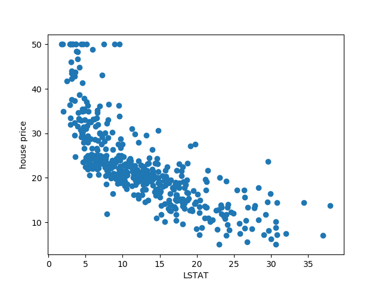
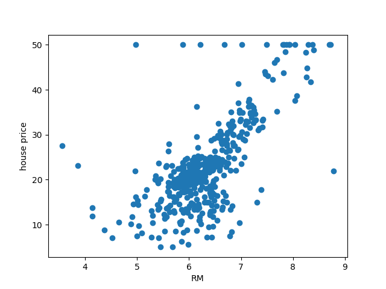
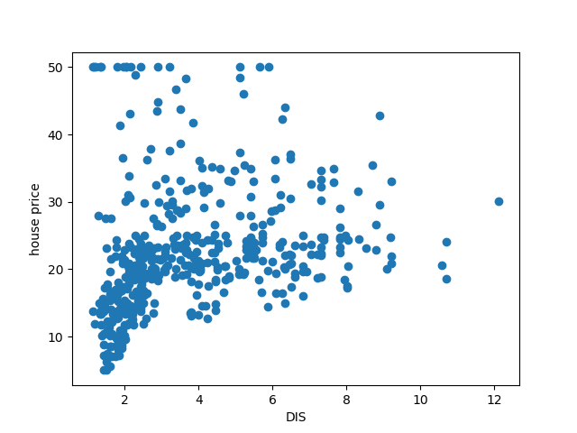
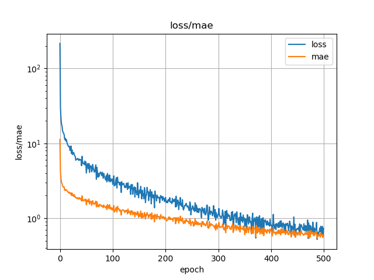

# ボストンハウスのデータを使った勾配ブースティング回帰  

## 概要  

ボストンハウスのデータ(13種類の指標と住宅価格のデータ）の予測をおこなうscikit learnの事例を元に、  
各推定器=決定木の構成を知ることで勾配ブースティング回帰(Gradient Boosting regression)の動作を理解する。  
また、ニューラルネットワークで予測した場合と比較する。
  
[github repository](https://github.com/shun60s/BostonHousing-GBR-NN)  

##  勾配ブースティング回帰(Gradient Boosting regression)で住宅価格を予測した場合  
### 動作方法  
  
```
python GBR.py
```

### 結果  

下図は、テストデータの予測誤差の平均と、予測から大きく外れたワースト10のリスト、各指標の(相対的な）重要度である。
  
  
誤差の平均値は小さくても、大きく外したケースも存在している。  
また、ニューラルネットワークと違い、住宅価格を予測するために使った指標（入力）の（相対的な）重要度の情報も得られる。  

ちなみに、相関関係を探るため、それぞれの指標と住宅価格の値をプロットすると以下のようになる。  
LSTAT: 低所得者の割合  
  


RM: 1戸あたりの平均部屋数  
  


DIS: ボストンの主な5つの雇用圏までの重み付き距離  
  


INDUS: 非小売業の土地面積の割合（人口単位）  
  
  
ここまでくると相関はよくわからない。  
  


###　推定器(estimator)=決定木(decision tree)の構成  

dotフォルダの中に以下がある。  

- tree0.dot,tree498.dotなど　推定器(estimator)=決定木(decision tree)の構成を dotファイルとして書き出したサンプル  
- tree0.png,tree498.pngなど　推定器(estimator)=決定木(decision tree)の構成を png（図形グラフ）に変換したサンプル  
- dot2png.bat （別のソフトの）dot.exeを使ってdotファイルをpng（図形グラフ）に変換するためのwindows用のバッチファイル  
  

tree0 は１番目の推定器(estimator)、tree498 は500番目の推定器(estimator)を示す。  
順番が上がっていくほど、端末の葉のvalue値は小さくなっていくようだ。  
　　


下図は、いろいろな手法による分類の境界線の例であるが、決定木(decision tree)はYes/No判定なので（曲線ではなく）離散的な境界となる。  
  

  
## ニューラルネットワークを使って住宅価格を予測した場合  

### 動作方法  

ニューラルネットワークの構成は4層のFCで、フレームワークとしてはkerasとtensorflowを使用した。  
```
python keras.py
```
引数オプションとして、エポック数(-e )、ユニット数(-u )、バッチサイズ(-b )も指定できる。  

下図は、学習時の損失(loss)と予測誤差の平均(mae)の様子である。  
  
  

### 結果  

下図は、テストデータの予測誤差の平均と、予測から大きく外れたワースト10のリストである。
  

この例では、勾配ブースティング回帰の結果よりよい結果になっているが、
ニューラルネットワークは初期値のとりかたによっても予測誤差は変わる。
ニューラルネットワークの方が悪い結果を出すときもあるので、一概にどちらがよいとは言い切れない。  


## ライセンス  

GBR.pyはそれに記載されているライセンスを参照してください。   
  

## 参考にしたもの  

- [scikit-learn, Gradient Boosting regression example](http://scikit-learn.org/stable/auto_examples/ensemble/plot_gradient_boosting_regression.html#sphx-glr-auto-examples-ensemble-plot-gradient-boosting-regression-py)
- [Deep Learning with Python】Boston Housing Datasetを用いた回帰問題](http://liaoyuan.hatenablog.jp/entry/2018/02/03/004849)
  

## 免責事項  
THE SOFTWARE IS PROVIDED "AS IS", WITHOUT WARRANTY OF ANY KIND, EXPRESS OR IMPLIED, 
INCLUDING BUT NOT LIMITED TO THE WARRANTIES OF MERCHANTABILITY, FITNESS 
FOR A PARTICULAR PURPOSE AND NONINFRINGEMENT. IN NO EVENT SHALL 
THE AUTHORS OR COPYRIGHT HOLDERS BE LIABLE FOR ANY CLAIM, DAMAGES OR OTHER LIABILITY, 
WHETHER IN AN ACTION OF CONTRACT, TORT OR OTHERWISE, ARISING FROM, 
OUT OF OR IN CONNECTION WITH THE SOFTWARE OR THE USE OR OTHER DEALINGS IN THE SOFTWARE.  
#### 上記はMITライセンスからの抜粋です。
